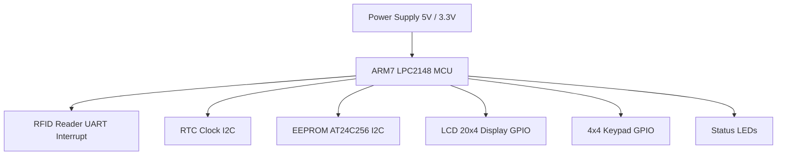

🚀 RFID Based Smart Electronic Voting System

ARM7 LPC2148 | Embedded C | UART Interrupt | I2C | RTC | EEPROM

📌 Project Overview

This project is a prototype RFID-based electronic voting system designed using the ARM7 LPC2148 microcontroller.

The system ensures:

-> Secure RFID-based voter authentication

-> Time-restricted voting using RTC

-> Officer controlled election configuration

-> Persistent vote storage using external EEPROM

-> The project demonstrates practical implementation of:

-> UART interrupt-driven communication

-> I2C peripheral communication

-> EEPROM memory mapping

-> Embedded menu driven firmware design

Real-time system control using RTC

🧠 System Block Diagram

flowchart TD

A[Power ON] --> B{Select Program}

B -->|Initial Setup Program| C[Initialize LPC2148 Peripherals]

C --> D[Write RFID Card IDs to EEPROM]
D --> E[Store Officer Password]
E --> F[Store Voter Passwords]
F --> G[Set Voting Flags]
G --> H[Set Default Voting Time]
H --> I[EEPROM Data Storage Completed]

B -->|Main Voting Application| J[Initialize LCD, UART, I2C, RTC, Keypad]

J --> K[Display Waiting for RFID Card]

K --> L[RFID Reader Sends Card ID via UART Interrupt]

L --> M[Controller Reads Card ID]

M --> N{Officer Card ?}

N -->|Yes| O[Show Officer Menu]
O --> P[Set Voting Time / Start Voting / Stop Voting / View Result / Reset]

N -->|No| Q[Verify Voter ID from EEPROM]

Q --> R{Voting Time Valid ?}

R -->|No| S[Display Voting Closed]

R -->|Yes| T{Already Voted ?}

T -->|Yes| U[Display Duplicate Vote Not Allowed]

T -->|No| V[Display Party List on LCD]

V --> W[Voter Selects Party Using Keypad]

W --> X[Update Vote Count in EEPROM]

X --> Y[Display Vote Casted Successfully]

Y --> K

-> Communication Interfaces

-> Peripheral	Protocol

-> RFID Reader	UART0 (Interrupt Based)

-> RTC	I2C

-> EEPROM	I2C

-> LCD	GPIO (4-bit mode)

-> Keypad	GPIO

⚙️ System Architecture

RFID Reader  → UART Interrupt → LPC2148 Controller

RTC Module   ↔ I2C

EEPROM       ↔ I2C

LCD Display  ↔ GPIO

Keypad Input ↔ GPIO

The LPC2148 microcontroller acts as the central controller, managing authentication, vote counting, storage, and user interaction.

🎯 Key Features

✔ RFID based voter authentication

✔ Officer access with password protection

✔ Voting allowed only during configured time

✔ Duplicate voting prevention

✔ EEPROM based permanent vote storage

✔ LCD based user interface

✔ Keypad based input system

✔ UART interrupt driven RFID reading

⚙️ How the System Works

1️⃣ Officer Configuration

Officer logs in using:

-> RFID card

-> Password

-> Officer can:

-> Set voting start time

-> Set voting end time

-> Start or stop voting

-> View results

-> Reset voting

-> Edit RTC time

2️⃣ Voting Process

-> System displays “Waiting for Card”.

-> Voter places RFID card near reader.

-> RFID reader sends card ID via UART.

-> LPC2148 receives card ID using UART interrupt.

--- Controller verifies: ---

-> Voting time validity (RTC)

-> Voter authentication (EEPROM)

-> Party list is displayed.

-> Voter selects option using keypad.

-> Vote count is updated and stored in EEPROM.

-> Green LED indicates successful vote.

--- 💾 EEPROM Memory Structure ---

Address	Data Stored

0x0001	Voting flags

0x0001	Voting start time

0x0002	Voting end time

0x0100	Officer credentials

0x0200	Voter IDs

0x0000	Vote counts

--- 🔄 Why UART Interrupt for RFID? ---

Using UART interrupt allows:

-> Efficient data reception

-> No continuous polling

-> Fast response to RFID card detection

-> Better CPU utilization

-> The interrupt service routine (ISR):

-> Receives RFID data

-> Stores card ID

-> Sets a flag for processing in the main loop

--- 🛠 Hardware Components ---

-> ARM7 LPC2148 Microcontroller

-> RFID Reader Module

-> RFID Cards

-> 20x4 LCD Display

-> 4x4 Matrix Keypad

-> AT24C256 EEPROM

-> RTC Module

-> Status LEDs

-> Power Supply

-> USB-to-UART Converter

----- 🧰 Tools Used -----

-> Keil µVision

-> Flash Magic

-> Embedded C

-> UART Communication

-> I2C Protocol Implementation

🎥 Project Demo

📺 Watch the full demo here:

https://youtu.be/krEoN26IEWM?si=Fgdo8XonVOpOCTyk

👨‍💻 Author

Gali Narendra

GitHub
https://github.com/ngali8032

YouTube
https://youtu.be/krEoN26IEWM?si=Fgdo8XonVOpOCTyk
